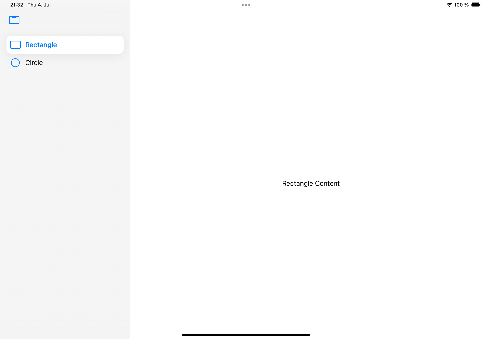

#  FB14195665 - SwiftUI: TabView should provide a way to apply a LabelStyle to the sidebar

## Scenario

A SwiftUI app using TabView showing the sidebar. 

## Issue

Except for the tint color there is no way to change the appearance of the sidebar list items.

	
## Example code

The example shows a TabView with a custom tint color and sets a .labelStyle that should change the tint of labels.

  

## Suggestion

There should be a way to set labelStyle for sidebar items, e.g. as .sidebarLabelStyle(...) on TabView.

## Tested on

	- Xcode Version 16.0 beta 2 (16A5171r)

